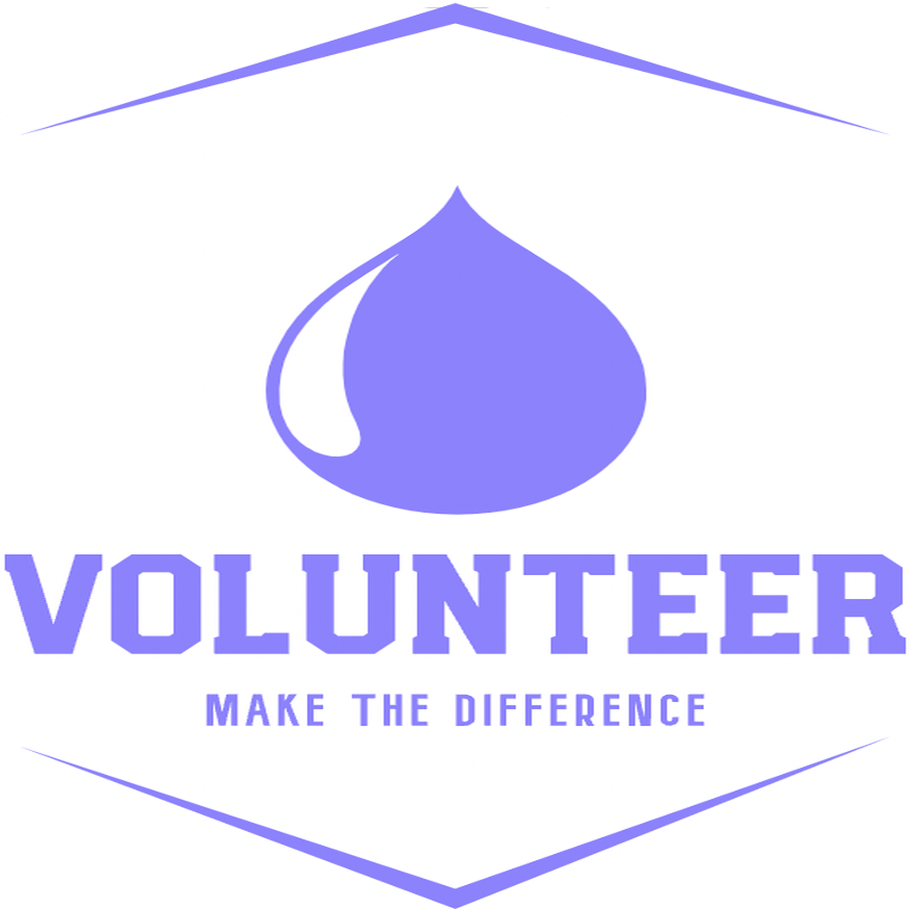

  
  <h2>A better way for matching you with the right volunteer opportunity.</h2>

## Features
* Rich media UX
* AI content recommendation
* Speech-to-Text
* Testimonials

## Tech
* React Native
* Google Firebase
* OpenAI API
* 

## Authors

